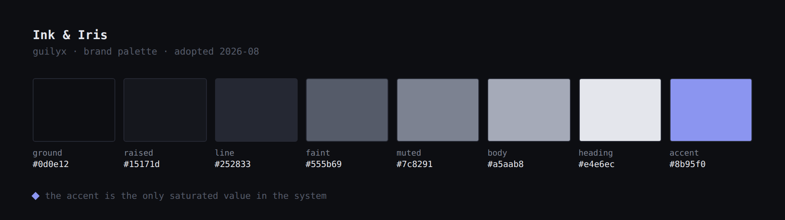
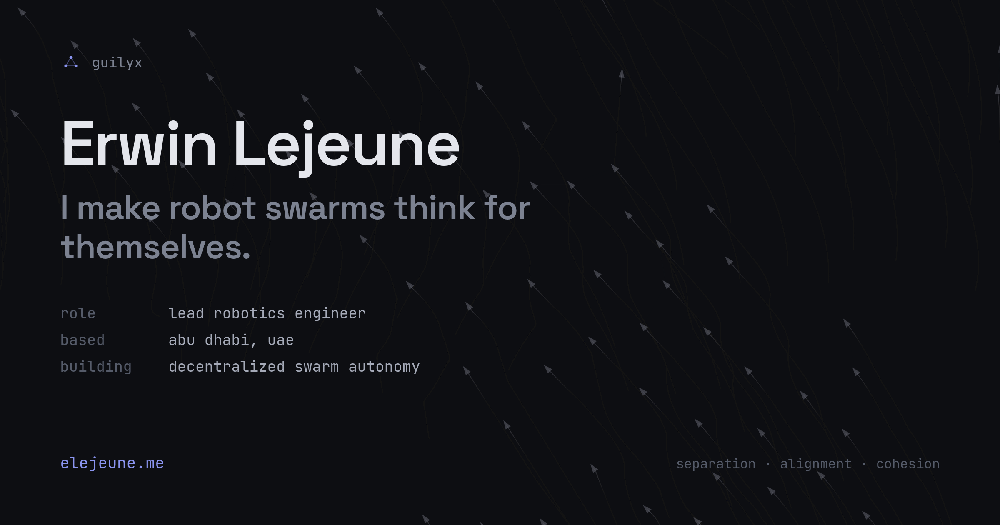

# branding

Personal brand system for **Erwin Lejeune** (`guilyx`) — the single source of
truth for colour, mark, and type across [elejeune.me](https://elejeune.me),
the [résumé](https://github.com/guilyx/resume), and anything else that carries
my name.

If a project's colours drift from this repo, this repo wins.

## Current brand

**Ink & Iris** — neutral-cool near-black under a periwinkle accent.



| Role | Token | Value |
| :--- | :--- | :--- |
| Ground | `--color-bg` | `#0d0e12` |
| Raised surface | `--color-bg-raised` | `#15171d` |
| Hairline | `--color-line` | `#252833` |
| Heading | `--color-heading` | `#e4e6ec` |
| Body | `--color-body` | `#a5aab8` |
| Muted | `--color-muted` | `#7c8291` |
| Faint | `--color-faint` | `#555b69` |
| Accent | `--color-accent` | `#8b95f0` |

Full rationale, usage rules, and the runner-up in
[`brand/palette.md`](brand/palette.md). Machine-readable copies live in
[`tokens/`](tokens/).

## Contents

```
brand/
├── palette.md        current palette, usage rules, accessibility notes
├── logo.md           the swarm mark — construction, sizing, misuse
└── voice.md          how the writing sounds
research/
├── palette-study.md  the five candidates that were considered, and why
└── differentiation.md what was borrowed from bchiang7/v4 and how it was replaced
tokens/
├── tokens.css        CSS custom properties
├── tokens.json       design-token JSON
└── tailwind.css      Tailwind v4 @theme block
assets/
└── logo/             SVG marks and favicons
```

## Attribution

The layout logic behind elejeune.me v4 — the restraint, the mono-label idea, the
overall shape — owes a real debt to
[Brittany Chiang's v4](https://v4.brittanychiang.com/)
([source](https://github.com/bchiang7/v4)). None of the colour, the mark, or the
structural devices documented here are hers; see
[`research/differentiation.md`](research/differentiation.md) for the full
accounting of what was borrowed, what was replaced, and why.

## Social card



The 1200×630 card used for Open Graph on elejeune.me. Built from the site's own
parts — the flock as a still, the mark, and the hero spec block — so a shared
link and the page it opens read as the same object. Source lives in the v4 repo;
regenerate it whenever the palette or the tagline changes.
