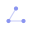

# The mark

Three filled circles at the vertices of an equilateral triangle, joined by a
faint **open** path that enters at the apex and stops at the third node.

## Why this

A route through three waypoints. It is the smallest possible drawing of the
thing I actually work on — planning: given a start, a goal, and something in
between, decide the order. Three is the minimum count where "route" means
anything at all.

The path is deliberately left **open**. A closed triangle reads as a formation:
a fixed shape held by a group, which was the older swarm framing this brand
moved away from in August 2026. An open path reads as a traversal — it has a
beginning and an end, and it went somewhere.

It also survives being small, which a monogram in a hexagon did not.

## Construction

On a 32 × 32 grid:

| Element | Geometry |
| :--- | :--- |
| Apex node | centre `(16, 8.5)`, r `2.1` |
| Left node | centre `(8.5, 21)`, r `2.1` |
| Right node | centre `(23.5, 21)`, r `2.1` |
| Route path | `M16 8.5 L8.5 21 L23.5 21`, stroke `1.1`, opacity `0.45` |

No trailing `Z` — the path is open by design, and closing it changes what the
mark means. Nodes are solid; the route is deliberately weaker than the nodes, so
the waypoints read as the subject and the path between them as the consequence.

## Files

| File | Use |
| :--- | :--- |
| `assets/logo/mark-accent.svg` | Default. Accent nodes, transparent ground. |
| `assets/logo/mark-mono.svg` | `currentColor` — inherits from context. Use in nav bars and buttons. |
| `assets/logo/favicon.svg` | 6px-radius ground tile plus the mark. Browser tabs. |
| `assets/logo/mark-lockup.svg` | Mark plus `guilyx` wordmark, horizontal. |

Every SVG above also ships as PNG, for the places that cannot take vector —
README badges, app-store and social forms, chat avatars, slide decks:

| File | Size |
| :--- | :--- |
| `assets/logo/mark-accent@{1,2,4}x.png` | 32 / 64 / 128 px |
| `assets/logo/mark-mono@{1,2,4}x.png` | 32 / 64 / 128 px, rendered at `--color-heading` |
| `assets/logo/favicon-{16,32,48,180,512}.png` | favicon and apple-touch sizes |
| `assets/logo/mark-lockup@{1,2,4}x.png` | 140 × 32 at 1×, wordmark included |

The PNGs are **generated, not drawn** — regenerate them with
[`assets/logo/render-png.sh`](../assets/logo/render-png.sh) after any change to
the SVGs rather than editing them by hand. `mark-mono` resolves `currentColor`
at render time, so its PNGs are baked to one colour and are not the file to
reach for when you need the mark to inherit from its context; use the SVG.

## Rules

- **Minimum size** 20 px. Below that the link path muddies — use a version with
  the path removed rather than shrinking further.
- **Clear space** at least the node radius (r) on every side.
- **Rotation** is allowed, and only in multiples of 120° — the mark is
  rotationally symmetric at that interval, so it lands back on itself. The
  site's nav uses a 120° turn on hover.
- **Colour**: accent nodes on a dark ground, or `currentColor` mono. Never a
  gradient, never more than one hue.
- **Don't** add a fourth node, fill the triangle, outline the nodes, place the
  mark on a busy photo, or set it in a circle or rounded square other than the
  favicon tile.

## Wordmark

`guilyx` — lowercase, always, in the mono face (JetBrains Mono, 400). The
lowercase is not a stylisation; it is how the handle is written everywhere else.

The full name **Erwin Lejeune** is set in the display face (Space Grotesk) and
is not part of the mark — it is typography, and it changes size and weight with
context.
